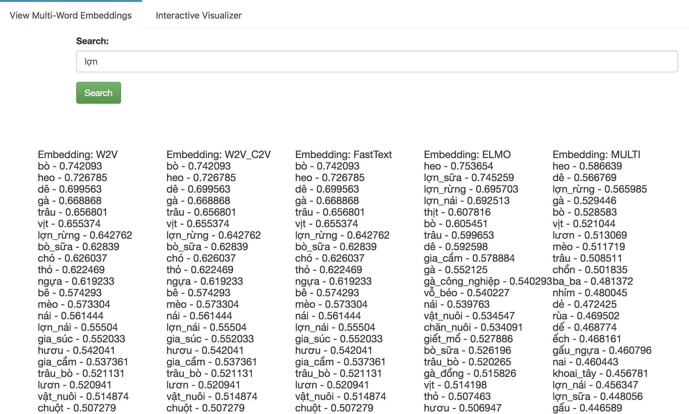
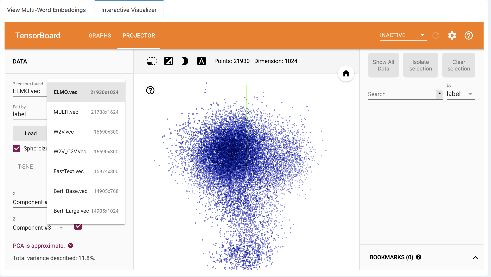

# I. ETNLP: A Toolkit for Extraction, Evaluation and Visualization of Pre-trained Word Embeddings
## A glimpse of ETNLP:
- Github: https://github.com/vietnlp/etnlp
- Video: https://vimeo.com/317599106
- Paper: https://arxiv.org/abs/1903.04433

# II. How do I cite ETNLP?

Please CITE paper [the Arxiv paper](https://arxiv.org/abs/1903.04433) whenever ETNLP (or the pre-trained embeddings) 
is used to produce published results or incorporated into other software:

```
@article{vu:2019n,
  title={ETNLP: A Toolkit for Extraction, Evaluation and Visualization of Pre-trained Word Embeddings},
  author={Xuan-Son Vu, Thanh Vu, Son N. Tran, Lili Jiang},
  journal={arXiv preprint arXiv:1903.04433},
  year={2019}
}
```

# III. More about ETNLP:
## 1. Embedding Evaluator: To compare quality of embedding models on the word analogy task.
- Input: a pre-trained embedding vector file (word2vec format), and word analogy file.
- Output: (1) evaluate quality of the embedding model based on the MAP/P@10 score, (2) Paired t-tests to show significant level between different word embeddings.

### 1.1. Note: The word analogy list is created by:
- Adopt from the English list by selecting suitable categories and translating to the target language (i.e., Vietnamese). 
- Removing inappropriate categories (i.e., category 6, 10, 11, 14) in the target language (i.e., Vietnamese).
- Adding custom category that is suitable for the target language (e.g., cities and their zones in Vietnam for Vietnamese).
Since most of this process is automatically done, it can be applied in other languages as well.

### 1.2. Selected categories for Vietnamese:  
> 1. capital-common-countries
> 2. capital-world
> 3. currency: E.g., Algeria | dinar | Angola | kwanza
> 4. city-in-zone (Vietnam's cities and its zone)
> 5. family (boy|girl | brother | sister)
> 6. gram1-adjective-to-adverb (NOT USED)
> 7. gram2-opposite (e.g., acceptable | unacceptable | aware | unaware)
> 8. gram3-comparative (e.g., bad | worse | big | bigger)
> 9. gram4-superlative (e.g., bad | worst | big | biggest)
> 10. gram5-present-participle (NOT USED)
> 11. gram6-nationality-adjective-nguoi-tieng (e.g., Albania | Albanian | Argentina | Argentinean)
> 12. gram7-past-tense (NOT USED)
> 13. gram8-plural-cac-nhung (e.g., banana | bananas | bird | birds) (NOT USED)
> 14. gram9-plural-verbs (NOT USED)

### 1.3 Evaluation results (in details)

* Analogy: Word Analogy Task

* NER (w): NER task with hyper-parameters selected from the best F1 on validation set.

* NER (w.o): NER task without selecting hyper-parameters from the validation set.

|             Model            | NER.w        | NER.w.o 	| Analogy 	|
|------------------------------	|------------- | ------------------	|------------------	|
| BiLC3 + w2v                 	| 89.01   | 89.41            	|         0.4796 |
| BiLC3 + Bert_Base           	| 88.26   | 89.91             | 0.4609 |
| BiLC3 + w2v_c2v             	| 89.46   | 89.46            	| 0.4796 |
| BiLC3 + fastText            	| 89.65   | 89.84            	|  0.4970 |
| BiLC3 + Elmo                	| 89.67 | 90.84            	| **0.4999** |
| BiLC3 + MULTI_WC_F_E_B        | **91.09**   | **91.75**        	| 0.4906|


## 2. Embedding Extractor: To extract embedding vectors for other tasks.
- Input: (1) list of input embeddings, (2) a vocabulary file.
- Output: embedding vectors of the given vocab file in `.txt`, i.e., each line conains the embedding for a word. The file then be compressed in .gz format. This format is widely used in existing NLP Toolkits (e.g., Reimers et al. [1]).

### Extra options:
- `-input-c2v`: character embedding file
- `solveoov:1`: to solve OOV words of the 1st embedding. Similarly for more than one embedding: e.g., `solveoov:1:2`.

[1] Nils Reimers and Iryna Gurevych, Reporting Score Distributions Makes a Difference: Performance Study of LSTM-networks for Sequence Tagging, 2017, http://arxiv.org/abs/1707.09861, arXiv.

## 3. Visualizer: to explore the embedding space and compare between different embeddings.

### Screenshot of viewing multiple-embeddings side-by-side


### Screenshot of viewing each embedding interactively



# III. Available Lexical Resources
## 1. Word Analogy List for Vietnamese

|  Word Analogy List          | Download Link (NER Task)| Download Link (General)| 
|------------------------------|---------------|---------------|
| Vietnamese (This work)       | [Link1](https://drive.google.com/open?id=1cBYVGwU59slI6bTe2maOW0_xj_e7XugW)| [Link1]|
| English (Mirkolov et al. [2]) | [Link2]| [Link2]|
| Portuguese (Hartmann et al. [3]) | [Link3]| [Link3]|


## 2. Multiple pre-trained embedding models for Vietnamese

- Training data: Wiki in Vietnamese:

|  # of sentences          | # of tokenized words| 
|------------------------------|---------------|
|   6,685,621          | 114,997,587 |


- Download Pre-trained Embeddings: <br>
(Note: The MULTI_WC_F_E_B is the concatenation of four embeddings: W2V_C2V, fastText, ELMO, and Bert_Base.)

|   Embedding Model           | Download Link (NER Task) |Download Link (General) | 
|------------------------------|---------------|---------------|
| w2v                          | [Link1](https://drive.google.com/open?id=1D3RvwFiRvvbP6GIcuff6LTUmm1i3yvdF) | [Link1] |
| w2v_c2v                      | [Link2](https://drive.google.com/open?id=1YWDmVq6ku7OzY8-Rsm_MsWQ5lH-uUb4h) | [Link2] |
| fastText                     | [Link3](https://drive.google.com/open?id=1EGsNoPX3acNCjYKAVD0T2r04A55lnEmH)| [Link3] |
| Elmo                         | [Link4](https://drive.google.com/open?id=1U2eWRWwgbva9OMyRvJKopn8FsmTLqMiq) | [Link4] |
| Bert_base                    | [Link5](https://drive.google.com/open?id=1ZEI6jHFYn-eptuf1nEwWQY8U4OXGeLx3) | [Link5] |
| MULTI_WC_F_E_B               | [Link6](https://drive.google.com/open?id=1Cr-3ST4aac8O807tDFEYsohDyXWUJVMV)  | [Link6] |


